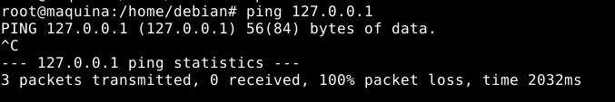
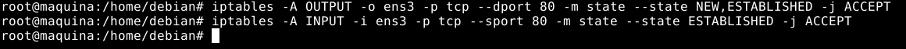

# Ejercicio 1: Implementación de un cortafuegos personal

Vamos a realizar los primeros pasos para implementar un cortafuegos en un nodo de una red, aquel que se ejecuta en el propio equipo que trata de proteger, lo que a veces se denomina un cortafuegos personal.

## Esquema de red

Vamos a utilizar una máquina en openstack, que vamos a crear con la receta heat: escenario1.yaml. La receta heat ha deshabilitado el cortafuego que nos ofrece openstack (todos los puertos de todos los protocolos están abiertos). La máquina creada tendrá un servidor web instalado. Vamos a trabajar con la red de las ips flotantes: 172.22.0.0/16.

## Limpieza de las reglas previas
```bash
iptables -F
iptables -t nat -F
iptables -Z
iptables -t nat -Z
```


## Vamos a permitir ssh

Cómo estamos conectado a la máquina por ssh, vamos a permitir la conexión ssh desde la red 172.22.0.0/16, antes de cambiar las políticas por defecto a DROP, para no perder la conexión:
```bash
iptables -A INPUT -s 172.22.0.0/16 -p tcp --dport 22 -m state --state NEW,ESTABLISHED -j ACCEPT
iptables -A OUTPUT -d 172.22.0.0/16 -p tcp --sport 22 -m state --state ESTABLISHED -j ACCEPT
```


## Política por defecto
```bash
iptables -P INPUT DROP
iptables -P OUTPUT DROP
```


Comprobamos que el equipo no puede acceder a ningún servicio ni de Internet ni de la red local, ya que la política lo impide.

Debido a estas políticas DROP que hemos aplicado...

No puedo hacer ping a localhost:



No puedo hacer ping a Internet:


Si no se nos corta la conexión ssh a la máquina después de este paso, el par de reglas que aplicamos antes funcionan.

## Permitimos tráfico para la interfaz loopback
```bash
iptables -A INPUT -i lo -p icmp -j ACCEPT
iptables -A OUTPUT -o lo -p icmp -j ACCEPT
```


## Peticiones y respuestas protocolo ICMP
```bash
iptables -A INPUT -i ens3 -p icmp --icmp-type echo-reply -j ACCEPT
iptables -A OUTPUT -o ens3 -p icmp --icmp-type echo-request -j ACCEPT
```


Comprobamos su funcionamiento haciendo ping a una IP pública:


## Consultas y respuestas DNS
```bash
iptables -A OUTPUT -o ens3 -p udp --dport 53 -m state --state NEW,ESTABLISHED -j ACCEPT
iptables -A INPUT -i ens3 -p udp --sport 53 -m state --state ESTABLISHED -j ACCEPT
```


Comprobamos su funcionamiento con una consulta DNS:
```bash
dig @1.1.1.1 www.josedomingo.org
```


## Tráfico http (que la máquina pueda navegar)
```bash
iptables -A OUTPUT -o ens3 -p tcp --dport 80 -m state --state NEW,ESTABLISHED -j ACCEPT
iptables -A INPUT -i ens3 -p tcp --sport 80 -m state --state ESTABLISHED -j ACCEPT
```


Comprobamos que funciona accediendo a un servicio http (! no https)
```bash
curl http://portquiz.net:80
```


## Tráfico https
```bash
iptables -A OUTPUT -o ens3 -p tcp --dport 443 -m state --state NEW,ESTABLISHED -j ACCEPT
iptables -A INPUT -i ens3 -p tcp --sport 443 -m state --state ESTABLISHED -j ACCEPT
```


Comprobamos que funciona abriendo un navegador y accediendo a cualquier sitio web (hoy en día la mayoría son https).


## Tráfico http/https

Podemos hacer un par de reglas que permitan el tráfico http/https (los dos puntos anteriores) usando la extensión multiport:
```bash
iptables -A OUTPUT -o ens3 -p tcp -m multiport --dports 80,443 -m state --state NEW,ESTABLISHED -j ACCEPT
iptables -A INPUT -i ens3 -p tcp -m multiport --sports 80,443 -m state --state ESTABLISHED -j ACCEPT
```


## Permitimos el acceso a nuestro servidor web
```bash
iptables -A INPUT -i ens3 -p tcp --dport 80 -m state --state NEW,ESTABLISHED -j ACCEPT
iptables -A OUTPUT -o ens3 -p tcp --sport 80 -m state --state ESTABLISHED -j ACCEPT
```


Compruebo que funciona desde mi host:


## Configuración en un solo paso

Editamos un fichero y añadimos todas las reglas anteriores:
```bash
nano reglas-iptables
```
```bash
### Limpiamos las tablas

iptables -F
iptables -t nat -F
iptables -Z
iptables -t nat -Z

### Establecemos la política

iptables -P INPUT DROP
iptables -P OUTPUT DROP

iptables -A INPUT -i lo -p icmp -j ACCEPT
iptables -A OUTPUT -o lo -p icmp -j ACCEPT

iptables -A INPUT -s 172.22.0.0/16 -p tcp --dport 22 -m state --state NEW,ESTABLISHED -j ACCEPT
iptables -A OUTPUT -d 172.22.0.0/16 -p tcp --sport 22 -m state --state ESTABLISHED -j ACCEPT

iptables -A INPUT -i ens3 -p icmp --icmp-type echo-reply -j ACCEPT
iptables -A OUTPUT -o ens3 -p icmp --icmp-type echo-request -j ACCEPT

iptables -A INPUT -i ens3 -p udp --sport 53 -m state --state ESTABLISHED -j ACCEPT
iptables -A OUTPUT -o ens3 -p udp --dport 53 -m state --state NEW,ESTABLISHED -j ACCEPT

iptables -A INPUT -i ens3 -p tcp --sport 80 -m state --state ESTABLISHED -j ACCEPT
iptables -A OUTPUT -o ens3 -p tcp --dport 80 -m state --state NEW,ESTABLISHED -j ACCEPT

iptables -A INPUT -i ens3 -p tcp --sport 443 -m state --state ESTABLISHED -j ACCEPT
iptables -A OUTPUT -o ens3 -p tcp --dport 443 -m state --state NEW,ESTABLISHED -j ACCEPT

iptables -A INPUT -i ens3 -p tcp --dport 80 -m state --state NEW,ESTABLISHED -j ACCEPT
iptables -A OUTPUT -o ens3 -p tcp --sport 80 -m state --state ESTABLISHED -j ACCEPT
```

## Ejercicios

### 1. Permite poder hacer conexiones ssh al exterior.
```bash
iptables -A OUTPUT -p tcp --dport 22 -m state --state NEW,ESTABLISHED -j ACCEPT
iptables -A INPUT -p tcp --sport 22 -m state --state ESTABLISHED -j ACCEPT
```


Pruebo que funciona conectando a mi host:
```bash
ssh ivan@172.22.4.176
```


### 2. Deniega el acceso a tu servidor web desde una ip concreta.

Antes de añadir la regla de bloqueo, debemos tener en cuenta nuestra situación actual de reglas en INPUT:
```bash
iptables -L -v -n
```


Como se puede ver, si añadiéramos la regla de bloqueo al final no serviría para nada porque siempre haría match con la que permite todo el tráfico http entrante (regla señalada).

Para solucionarlo, añadimos por encima la nueva regla.

Necesitamos saber el número de línea específico, así que ejecutamos:
```bash
iptables -L -v -n --line-numbers
```


Vamos a añadir la regla de bloqueo en la posición marcada para que funcione:
```bash
iptables -I INPUT 8 -s 172.22.200.150 -p tcp --dport 80 -m state --state NEW,ESTABLISHED -j DROP
```


Ya tenemos la regla en la posición que queríamos. Ahora comprobamos que bloquea el tráficoa mi máquina alfa:
```bash
curl 192.168.0.235 80
```


Vamos a comprobarlo desde otra ip que no es la bloqueada, mi anfitrión:
```bash
curl 192.168.0.235 80
```


### 3. Permite hacer consultas DNS sólo al servidor 192.168.202.2. Comprueba que no puedes hacer un dig @1.1.1.1.

Nos encontramos en una situación parecida a la del ejercicio anterior, pero en este caso tenemos que borrar 2 reglas antiguas que permitían el tráfico DNS saliente a todo: 
```bash
iptables -L -v -n
```


Incluso si añadiéramos las nuevas reglas por encima de estas, cuando hiciésemos dig a 1.1.1.1 llegaría a hacer match con estas reglas y permitiría el tráfico, y eso no es lo que queremos.

Primero, borramos las reglas antiguas:
```bash
iptables -D OUTPUT -o ens3 -p udp --dport 53 -m state --state NEW,ESTABLISHED -j ACCEPT
iptables -D INPUT -i ens3 -p udp --sport 53 -m state --state ESTABLISHED -j ACCEPT
```


Segundo, añadimos las nuevas reglas:
```bash
iptables -A OUTPUT -d 192.168.202.2 -p udp --dport 53 -m state --state NEW,ESTABLISHED -j ACCEPT
iptables -A INPUT -s 192.168.202.2 -p udp --sport 53 -m state --state ESTABLISHED -j ACCEPT
```


Pruebo que las consultas DNS a 192.168.202.2 funcionan:
```bash
dig @192.168.202.2 www.example.org
```


Pruebo que las consultas DNS a 1.1.1.1 no funcionan:
```bash
dig @1.1.1.1 www.example.org
```


### 4. No permitir el acceso al servidor web de www.josedomingo.org (Tienes que utilizar la ip). ¿Puedes acceder a fp.josedomingo.org?

De nuevo, tendríamos una situación de conflicto de reglas si la siguiente la añadiéramos al final, porque antes tenemos una que permite todo el tráfico http saliente y los matchs se quedarían siempre ahí:
```bash
iptables -L -v -n --line-numbers
```


Tendremos que añadir la regla de bloqueo por encima de la anterior mostrada:
```bash
iptables -I OUTPUT 5 -d 37.187.119.60 -p tcp --dport 80 -m state --state NEW,ESTABLISHED -j DROP
```


Se nos quedarían las reglas así:
```bash
iptables -L -v -n --line-numbers
```


Pruebo que no funciona el tráfico http saliente a www.josedomingo.org:
```bash
curl www.josedomingo.org
```


Se quedará esperando infinitamente porque no hay conexión.

Pruebo a ver si funciona el tráfico http saliente a fp.josedomingo.org:
```bash
curl fp.josedomingo.org
```


Tampoco hay conexión. No funciona ya que fp.josedomingo.org se acaba traduciendo a la misma IP que hemos bloqueado antes.

Pruebo que cualquier otro tráfico http saliente funciona:
```bash
curl www.google.com
```


### 5. Permite mandar un correo usando nuestro servidor de correo: babuino-smtp. Para probarlo ejecuta un telnet bubuino-smtp.gonzalonazareno.org 25.

Lo primero que haremos será crear las reglas Iptables:
```bash
iptables -A OUTPUT -d 192.168.203.3 -p tcp --dport 25 -j ACCEPT
iptables -A INPUT -s 192.168.203.3 -p tcp --sport 25 -j ACCEPT
```


Pruebo que funciona con telnet:
```bash
telnet babuino-smtp.gonzalonazareno.org 25
```


### 6. Instala un servidor mariadb, y permite los accesos desde la ip de tu cliente. Comprueba que desde otro cliente no se puede acceder.

Instalamos mariadb-server y habilitamos conexiones remotas:
```bash
apt install mariadb-server
```

Editamos el siguiente fichero /etc/mysql/mariadb.conf.d/50-server.cnf:
```bash
bind-address            = 0.0.0.0
```

Reiniciamos mariadb:
```bash
systemctl restart mariadb
```

Ahora, permitimos tráfico entrante desde mi host:
```bash
iptables -A INPUT -s 172.22.4.176 -p tcp --dport 3306 -j ACCEPT
iptables -A OUTPUT -d 172.22.4.176 -p tcp --sport 3306 -j ACCEPT
```


Probamos que funciona:
```bash
nc -zvw10 172.22.200.60 3306
```


Comprobamos que desde otro cliente que se bloquea el tráfico:
```bash
nc -zvw10 172.22.200.60 3306
```

